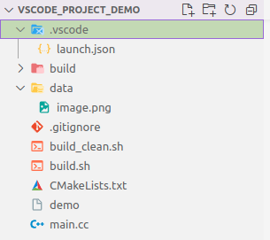
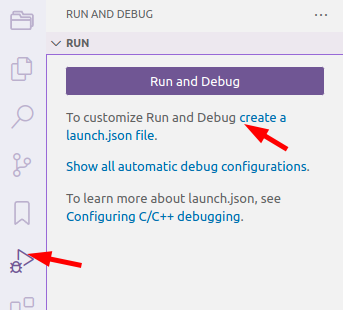
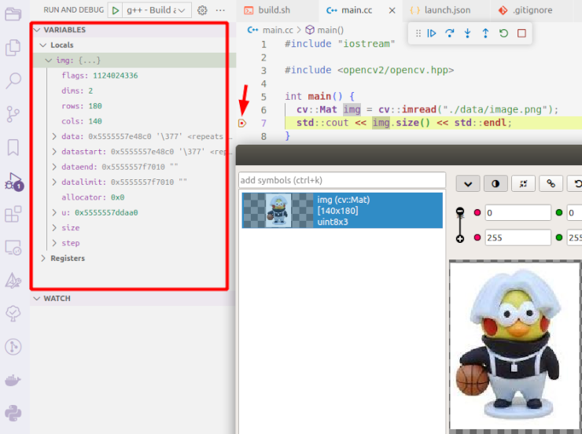
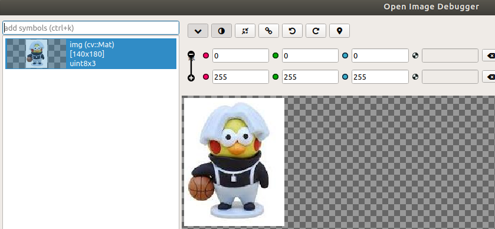
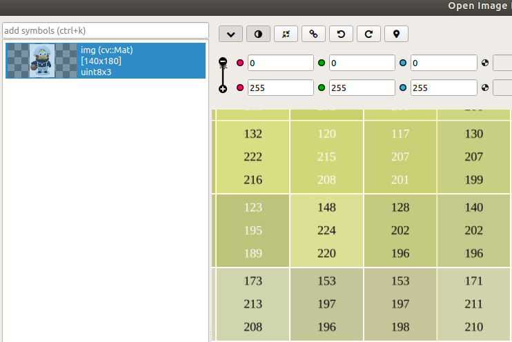

# vscode的C++与OpenCV开发配置

本文主要描述如何便捷地在ubuntu下使用vscode开发opencv-c++项目，非常适合vscode或者linux新手使用，主要包含以下内容：

* 编写CMakeLists.txt编译c++ opencv项目
* 编写launch.json实现代码单步调试
* 配置调试过程中矩阵变量查看工具-OpenImageDebugger
* 一个完整的初始C++ project demo

项目文件结构



## 1. CMakeLists.txt编写

vscode下载、安装和c++相关插件配置这里不做赘述，以下是实现c++ opencv工程编译的CMakeLists.txt文件。

```

cmake_minimum_required(VERSION 3.19 )

project("demo")
# set(CMAKE_BUILD_TYPE Release)  
# set(CMAKE_CXX_FLAGS_RELEASE "${CMAKE_CXX_FLAGS_RELEASE} -std=c++14 -Ofast")
set(CMAKE_BUILD_TYPE Debug)  # 没有这句话vscode无法单步调试
set(CMAKE_CXX_FLAGS_DEBUG "${CMAKE_CXX_FLAGS_DEBUG} -std=c++14 -O0")
SET(EXECUTABLE_OUTPUT_PATH ${PROJECT_SOURCE_DIR})

# OpenCV
message(STATUS "ZHITO_THIRD_PARTY_DIR:${ZHITO_THIRD_PARTY_DIR}")
set(OpenCV_DIR "${ZHITO_THIRD_PARTY_DIR}/OpenCV320/share/OpenCV")
find_package(OpenCV 3.2 REQUIRED) # 版本设置
include_directories(${OpenCV_INCLUDE_DIRS})
message(STATUS "OpenCV version: ${OpenCV_VERSION}")
message(STATUS "OpenCV_LIBS:${OpenCV_LIBS}")
message(STATUS "OpenCV_INCLUDE_DIRS:${OpenCV_INCLUDE_DIRS}")

add_executable(demo main.cc)

target_link_libraries(demo ${OpenCV_LIBS} pthread)
```

#### 编译相关脚本

* build_clean.sh
  修改CMakeLists.txt后，使用该脚本重新编译文件

  ```
  cd ./build
  rm -rf *
  make clean
  cmake ..
  make
  ```
* build.sh
  修改代码后，使用该脚本重新编译文件

  ```
  cd ./build
  cmake ..
  make
  ```

#### 编译运行工程

```
git clone 
cd 
mkdir build
./build.sh
./demo
```

**控制台显示信息**

```
img size [140 x 180]
```

## 2. launch.json编写

#### 0. cpp项目相关json配置文件

vscode 的cpp工程配置一般有：

* c_cpp_properties.json
  * c/c++配置用文件，比如头文件路径，全局定义等
* launch.json
  * 调试配置，按F5启动调试时，从该配置文件读取设置和相关配置
* tasks.json
  * 调试配置，对应launch.json文件中的preLaunchTask项
* settings.json
  * 工程设置，编译设置等

#### 1. 添加launch.json文件

1. 点击run and Debug 按钮，出现提示 create a launch.json file, 点击创建文件。

   > 本项目没有创建tasks.json文件用于调试前的编译设置，而是将编译和开始调试功能分开。
   >



2. launch.json默认生成内容

```
{
  // Use IntelliSense to learn about possible attributes.
  // Hover to view descriptions of existing attributes.
  // For more information, visit: https://go.microsoft.com/fwlink/?linkid=830387
  "version": "0.2.0",
  "configurations": []
}
```

#### 2. 修改launch.json文件

```
{
    // Use IntelliSense to learn about possible attributes.
    // Hover to view descriptions of existing attributes.
    // For more information, visit: https://go.microsoft.com/fwlink/?linkid=830387
    "version": "0.2.0",
    "configurations": [  
        {
            "name": "g++ - Build and debug active file",
            "type": "cppdbg",
            "request": "launch",
            "program": "${workspaceFolder}/demo", // 重要，一般要修改该路径，此路径是相对activae file，与task.json中 -o输出内容一致
            "args": [], // 存放argv参数
            "stopAtEntry": false,
            "cwd": "${fileDirname}",
            "environment": [],
            "externalConsole": false,
            "MIMode": "gdb",
            "setupCommands": [
                {
                    "description": "Enable pretty-printing for gdb",
                    "text": "-enable-pretty-printing",
                    "ignoreFailures": true
                }
            ],
            // "preLaunchTask": "run script",    // 可以注释掉，手动编译再调试，该文件对应task.json中的任务(label标签对应内容)。
            "miDebuggerPath": "/usr/bin/gdb" // 调试器路径， linux
            //"miDebuggerPath": "C:\\Program Files\\mingw64\\bin\\gdb.exe" // windows平台使用
        }
    ]
}
```

#### 3. 启动调试

1. 在第7行打断点，按F5键启动调试后，可以在左侧看到相关调试信息。



## 3. 配置OpenImageDebugger

在windows平台，visual studio有个非常好用的opencv图像调试工具-imagewatch。在linux平台同样有该类型工具[OpenImageDebugger](https://github.com/OpenImageDebugger/OpenImageDebugger)。

具体配置步骤可以参考该repo的readme文件。

* 在add symbols栏输入变量名称即可查看该图像



* 使用鼠标滚轮可以放大图像，查看各通道像素值。



## 4. 参考

[VSCode的C/C++工程json文件配置](https://blog.csdn.net/weixin_43687811/article/details/122744673)

[b站视频](https://www.bilibili.com/video/BV1fy4y1b7TC/?spm_id_from=333.337.search-card.all.click)
