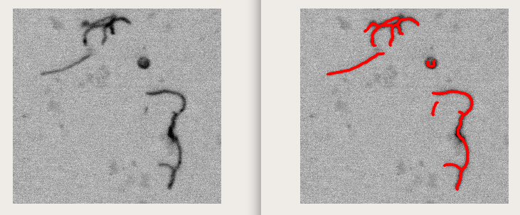
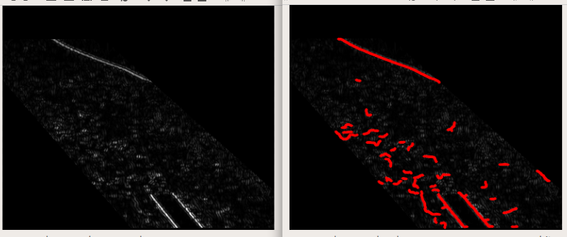

# ridge detection

## results

## ref

java: https://github.com/thorstenwagner/ij-ridgedetection/blob/master/src/main/java/de/biomedical_imaging/ij/steger/Link.java

cpp: https://github.com/DarisaLLC/ridge_strands
